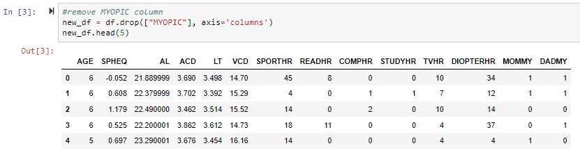
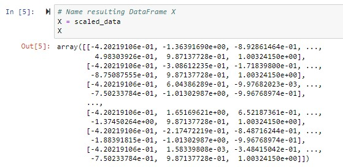
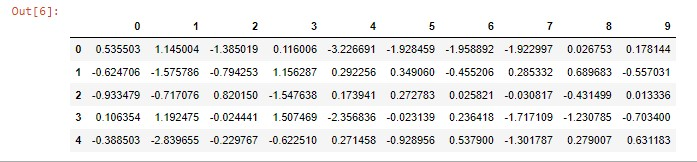
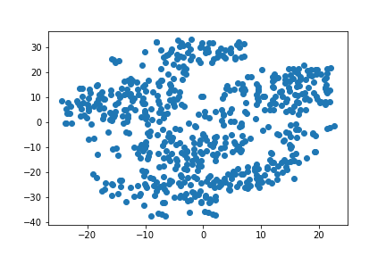
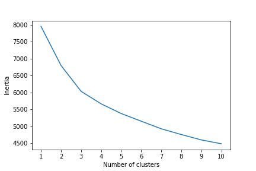

# Module 20 Challenge
## Predicting Myopia

# Background
You are on the data science team of a medical research company that’s interested in finding better ways to predict myopia, or nearsightedness. Your team has tried—and failed—to improve their classification model when training on the whole dataset. However, they believe that there might be distinct groups of patients that would be better to analyze separately. So, your supervisor has asked you to explore this possibility by using unsupervised learning.

You have been provided with raw data, so you’ll first need to process it to fit the machine learning models. You will use several clustering algorithms to explore whether the patients can be placed into distinct groups. Then, you’ll create a visualization to share your findings with your team and other key stakeholders.

# Part 1: Prepare the Data
Read in csv using Pandas and remove the "MYOPIC" column to ensure the unsupervised model will be unbiased. Then, we standardize the dataset so that colums that contain larger values do not influence the outcome.


## Scaled Dataset:



# Part 2: Apply Dimensionality Reduction
```python
# Perform dimensionality reduction with PCA. 
# How did the number of features change?

#initialize PCA model
pca = PCA(n_components=0.90)

myopia_pca = pca.fit_transform(X)

#transfrom pca data into a dataframe
df_myopia_pca = pd.DataFrame(
    data=myopia_pca)
df_myopia_pca.head()
```
## How did the number of features change?
After performing dimensionality reduction with PCA (and preserving 90% of the explained variance), the number of features went from 14 to 10.



## t-SNE Model
The t-SNE model is created to reduce dimensions of the scaled dataset

```python
# run t-SNE on the principal components (the output of the PCA transformation)
tsne = TSNE(learning_rate=250)
tsne_features = tsne.fit_transform(myopia_pca)
tsne_features.shape

(618, 2)


# Create a scatter plot of the t-SNE output. 
# Plot the results
plt.scatter(tsne_features[:,0], tsne_features[:,1])
plt.show()
```


There are no distinct clusters

# Part 3: Perform a Cluster Analysis with K-means
Create an elbow plot to identify the best number of clusters

```python
# Identify the best number of clusters using the elbow curve
inertia = []

k = list(range(1,11))


# Looking for the best k
for i in k:
    km = KMeans(n_clusters=i, random_state=0)
    km.fit(df_myopia_pca)
    inertia.append(km.inertia_)

# Define a DataFrame to plot the Elbow Curve using hvPlot
elbow_data = {"k": k, "inertia": inertia}
df_elbow = pd.DataFrame(elbow_data)
```



# Part 4: Recommendation
Based on the models, it does not appear that patients can be clustered apporpriately to better prediect myopia. After performing the PCA here are still a large numer of features that contribute to the variance. Additionally, after running t-SNE on the prinicpal components there are no clear clusters shown in the data. Finally, after running the K-means model, the plot does not show a clear elbow to point out if any groups exist in the data.